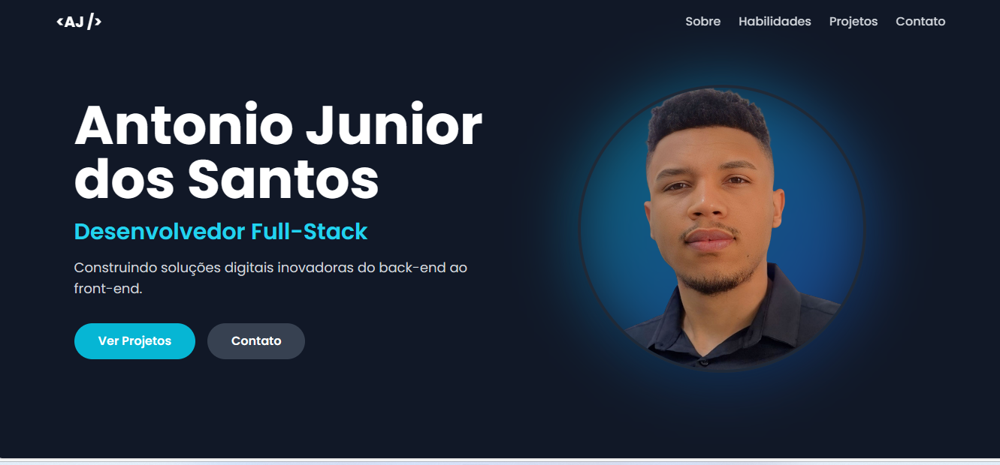

<div align="center">
  
</div>

# Portfólio Pessoal - Antonio Junior dos Santos

> Um portfólio moderno desenvolvido em React + TypeScript para apresentar meus projetos, habilidades e informações de contato como desenvolvedor Full-Stack.

## Sobre o Projeto

Este projeto tem como objetivo centralizar e apresentar meus principais projetos, experiências e competências técnicas de forma visual e acessível. O portfólio é responsivo, com animações e navegação fluida, e pode ser facilmente adaptado para outros profissionais de tecnologia.

### Principais Funcionalidades

- Seção "Sobre mim" com resumo profissional
- Listagem de projetos com links para repositórios e demonstrações
- Exibição de habilidades técnicas separadas por categoria
- Contatos e links para redes sociais

## Tecnologias Utilizadas

- React
- TypeScript
- Vite
- Tailwind CSS
- Node.js (para ambiente de desenvolvimento)

## Como Executar Localmente

**Pré-requisitos:** Node.js

1. Instale as dependências:
   ```bash
   npm install
   ```
2. Execute o app:
   ```bash
   npm run dev
   ```
3. Acesse no navegador o endereço exibido no terminal (ex: http://localhost:5173)

## Deploy

O deploy deste portfólio é feito no GitHub Pages, disponível em:
https://antonio-jdev.github.io/portfolio-01/

## Licença

Este projeto é open-source e pode ser utilizado e adaptado livremente.
